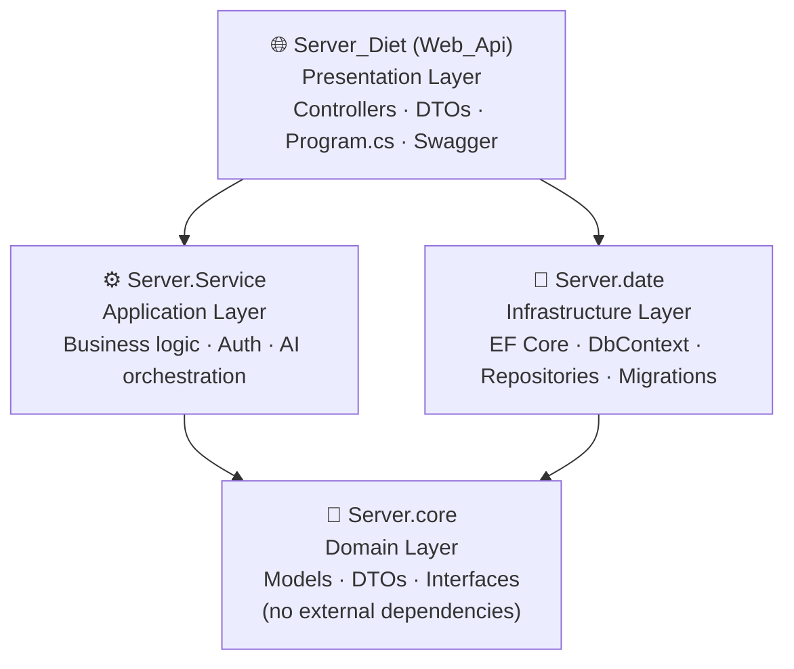

# 🥗 RightBite

**RightBite** is a full-stack nutrition and meal-tracking application. Users register with their body metrics (weight, height, age, gender, and goal), and the system automatically calculates their personalized daily calorie and macronutrient targets. Throughout the day, users log the meals they eat — by searching an existing food database, or by adding a new food using **AI**, based on a **name**, a **free-text description**, or an **uploaded photo**. A daily dashboard visualizes progress toward calorie, protein, carb, and fat targets.

---

## ✨ Features

- 🔐 **Authentication** — secure registration/login with hashed passwords (BCrypt) and JWT-based sessions.
- 📏 **Personalized nutrition goals** — daily calorie and macro (protein/carbs/fat) targets calculated automatically from the user's weight, height, age, gender, and goal (lose / maintain / gain weight), using the Mifflin-St Jeor BMR formula.
- 🔎 **Food search** — search an existing food catalog before logging a meal.
- 🤖 **AI-powered food entry** — can't find a food? Add it automatically using Google **Gemini**, by providing just a **name**, a **description**, or a **photo** of the meal — the AI estimates calories, protein, carbs, and fat.
- 📅 **Daily meal tracking** — log meals per date, view/edit/delete past entries.
- 📊 **Daily nutrition dashboard** — visual progress rings/summary of calories and macros consumed vs. daily targets.
- ✉️ **Transactional email** — email delivery (e.g. notifications) via the Resend API.

---

## 🏗️ Architecture

The backend follows **Clean Architecture** principles, separating the system into independent layers with a strict, one-directional dependency rule: outer layers depend on inner layers, never the other way around. This keeps business logic isolated from frameworks, UI, and databases, and makes the system easier to test, maintain, and extend.



**Simple rule:** every arrow above means *"depends on."* Dependencies only ever point **inward**, toward `Server.core`. The Domain layer depends on nothing else — it's the stable center of the system.

| Layer | Project | Responsibility |
|---|---|---|
| **Domain / Core** | `Server.core` (`Core.csproj`) | Domain entities (`User`, `Food`, `UserMeal`), DTOs (`Resource` classes), and the **interfaces** (`IUserRepository`, `IFoodService`, etc.) that outer layers implement. Has no dependency on any other project. |
| **Infrastructure (Data)** | `Server.date` (`Data.csproj`) | EF Core `DbContext` (`DietContext`), repository implementations, and database migrations. Implements the repository interfaces defined in Core. |
| **Application (Service)** | `Server.Service` (`Service.csproj`) | Business logic: nutrition-goal calculations, authentication, meal analysis orchestration, email sending. Implements the service interfaces defined in Core. |
| **Presentation (API)** | `Server_Diet` (`Web_Api.csproj`) | ASP.NET Core Web API — controllers, JWT authentication, dependency injection wiring, Swagger docs. Depends on all three layers above but contains no business logic itself. |

The **Angular** client is a separate, independent application that communicates with the API exclusively over HTTP.

---

## 🛠️ Tech Stack

### Backend
- **.NET 8** / **ASP.NET Core Web API**
- **C#**
- **Entity Framework Core 8** (Code-First + Migrations)
- **SQL Server**
- **JWT Bearer Authentication**
- **AutoMapper** — object-to-object mapping between entities and DTOs
- **BCrypt.Net-Next** — password hashing
- **Swashbuckle (Swagger)** — API documentation/testing UI
- **Google Gemini API** — AI-based food/nutrition analysis (by name, description, or image)
- **Resend API** — transactional email delivery

### Frontend
- **Angular 21** (standalone components, signals)
- **TypeScript**
- **PrimeNG** + **PrimeFlex** + **PrimeIcons** — UI component library
- **Bootstrap 5**
- **SweetAlert2** — alerts/notifications
- **RxJS**

### Database
- **Microsoft SQL Server**, accessed via EF Core with a Code-First approach. The schema (`Users`, `Foods`, `UserMeals`, and their relationships) is defined by the C# models in `Server.core/Models` and materialized/versioned through the migrations in `Server.date/Migrations`.

---

## 📁 Project Structure

```
RightBite/
├── Client/                 → Angular frontend
└── Server_Diet/             → Backend solution (Server_Diet.sln)
    ├── Server_Diet/          → Presentation layer (Web_Api)
    ├── Server.core/          → Domain layer (Core)
    ├── Server.Service/       → Application layer (Service)
    └── Server.date/          → Infrastructure layer (Data)
```

**Client/** (Angular)
```
src/app/
├── core/component/     login, register, home-page, add-food, add-custom-food,
│                        daily-tracker, meal-list, date-selector, nav
├── core/services/      user, meal, food, food-analysis, mail
├── interceptors/       auth.interceptor.ts  (attaches JWT to requests)
└── shared/models/      TS interfaces matching backend DTOs
```

**Server_Diet/** (.NET solution)
```
Server_Diet/            Controllers/ (Users, Food, UserMeal, Email) · Dto/ · Program.cs
Server.core/             Models/ · Resource/ (DTOs) · Repository/ (interfaces) · Services/ (interfaces) · Mapping/
Server.Service/          UserService (BMR/calorie/macro calc, auth) · FoodService · UserMealService ·
                          GeminiFoodAnalysisService (AI) · EmailService
Server.date/              DietContext.cs · DataRepository/ · Migrations/
```

---

## 🚀 Getting Started

### Prerequisites

Make sure you have the following installed:

| Tool | Version | Notes |
|---|---|---|
| [.NET SDK](https://dotnet.microsoft.com/download) | 8.0 | Backend runtime/SDK |
| [Node.js](https://nodejs.org/) | 20.x LTS or newer | Required by Angular 21 |
| [Angular CLI](https://angular.dev/tools/cli) | 21.x | `npm install -g @angular/cli` |
| [SQL Server](https://www.microsoft.com/sql-server) | 2019+ (or SQL Server Express / LocalDB) | Database engine |
| [EF Core CLI tools](https://learn.microsoft.com/ef/core/cli/dotnet) | matching EF Core 8 | `dotnet tool install --global dotnet-ef` |
| A **Google Gemini API key** | — | For AI food analysis |
| A **Resend API key** | — | For sending emails |

> 💡 The repository's `.gitignore` excludes `node_modules/`, `bin/`, `obj/`, build output, and all local configuration files (`appsettings.Development.json`, `appsettings.Local.json`, `.env*`). You must generate/restore those locally using the steps below — they will not be present after cloning.

### 1. Clone the repository

```bash
git clone https://github.com/<your-username>/RightBite.git
cd RightBite
```

### 2. Backend setup (`Server_Diet/`)

1. **Restore NuGet packages** (also happens automatically on build):
   ```bash
   cd Server_Diet
   dotnet restore
   ```

2. **Create your local configuration file.**
   The repo ships an `appsettings.example.json` (safe to commit) instead of a real `appsettings.json`/`appsettings.Development.json` (both are git-ignored, since they hold secrets). Copy the example and fill in your own values:

   ```bash
   cd Server_Diet
   cp appsettings.example.json appsettings.Development.json
   ```

   Edit `appsettings.Development.json`:

   ```json
   {
     "ConnectionStrings": {
       "DietDb": "Server=YOUR_SERVER;Database=RightBiteDb;Trusted_Connection=True;TrustServerCertificate=True"
     },
     "Jwt": {
       "Key": "A_LONG_RANDOM_SECRET_KEY",
       "Issuer": "RightBiteBackend",
       "Audience": "RightBiteAngular"
     },
     "GeminiSettings": {
       "ApiKey": "YOUR_GEMINI_API_KEY"
     },
     "ResendApiKey": "YOUR_RESEND_API_KEY"
   }
   ```

   - `ConnectionStrings:DietDb` — your SQL Server connection string.
   - `Jwt:Key` — any long, random secret string (used to sign JWT tokens).
   - `GeminiSettings:ApiKey` — get one at [Google AI Studio](https://aistudio.google.com/).
   - `ResendApiKey` — get one at [resend.com](https://resend.com/).

3. **Apply database migrations** (creates the database and schema from the EF Core migrations in `Server.date/Migrations`):
   ```bash
   dotnet ef database update --project Server.date --startup-project Server_Diet
   ```

4. **Run the API:**
   ```bash
   dotnet run --project Server_Diet
   ```
   The API will start (by default) on the URL(s) shown in the console — check `Server_Diet/Properties/launchSettings.json`. Swagger UI is available at `/swagger` in the Development environment for exploring and testing all endpoints.

### 3. Frontend setup (`Client/`)

1. **Install dependencies:**
   ```bash
   cd Client
   npm install
   ```

2. **Run the dev server:**
   ```bash
   npm start
   ```
   The app will be available at `http://localhost:4200`, and is pre-configured (via CORS on the backend) to talk to the API at `http://localhost:4200` origin — make sure the backend is running first.

3. **Build for production:**
   ```bash
   npm run build
   ```

### 4. Verify it's working

- Backend Swagger docs: `https://localhost:<port>/swagger`
- Frontend: `http://localhost:4200`
- Register a new user → the app calculates your daily calorie/macro targets automatically.
- Log a meal by searching, or by adding a new food via AI (name / description / photo).

---
## 🔑 Environment & Secrets Summary

| File | Committed to Git? | Purpose |
|---|---|---|
| `appsettings.example.json` | ✅ Yes | Configuration template containing placeholder values. |
| `appsettings.json` | ✅ Yes | Base ASP.NET Core configuration without sensitive values. |
| `appsettings.Development.json` | ❌ No | Local development configuration containing sensitive values such as the database connection string, JWT secret, Gemini API key, and Resend API key. |
| `Client/` | ✅ Yes | Angular frontend. No `.env` file is currently required. |

### 🔒 Security

Real secrets must never be committed to the repository.

Sensitive configuration should be stored locally in `appsettings.Development.json`, which is excluded from Git.

The `appsettings.example.json` file is provided as a template so that developers can configure the application locally without exposing private credentials.

---

## 📡 Key API Endpoints

| Method | Endpoint | Description | Auth |
|---|---|---|---|
| `POST` | `/api/Users/Register` | Register a new user + calculate nutrition goals | — |
| `POST` | `/api/Users/Login` | Authenticate and receive a JWT | — |
| `GET` | `/api/Food/search?nameFood=...` | Search foods by name | — |
| `POST` | `/api/UserMeal/analyze` | AI-analyze a meal by name / description / photo | — |
| `POST` | `/api/UserMeal` | Log a meal for a user | ✅ |
| `GET` | `/api/UserMeal/GetDailyNutrition?id=&date=` | Get a user's daily nutrition summary | — |
| `GET` | `/api/UserMeal/GetUserMealsByDate?id=&date=` | Get a user's meals for a given date | — |
| `POST` | `/api/Email/send` | Send an email via Resend | — |

Full, interactive documentation for every endpoint is available via Swagger once the backend is running.

---

## 📸 Screenshots

<!-- Add your screenshots below. Example:
### Home / Login


### Register — Nutrition Goals Calculated Automatically


### Daily Tracker — Calories & Macros


### Add Food via AI (name / description / photo)

-->

---

## 📄 License

Add a license of your choice (e.g. MIT) by creating a `LICENSE` file in the repository root.
